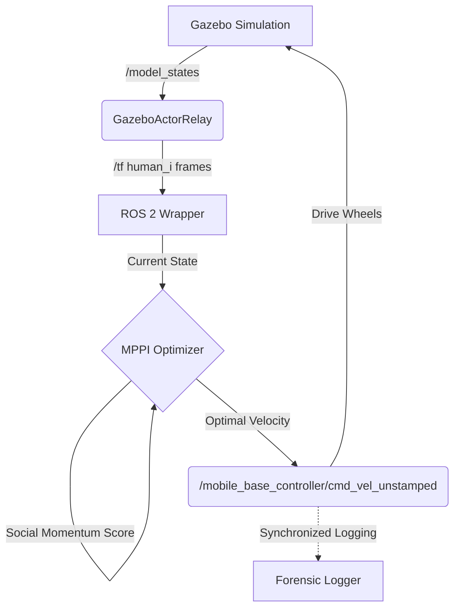
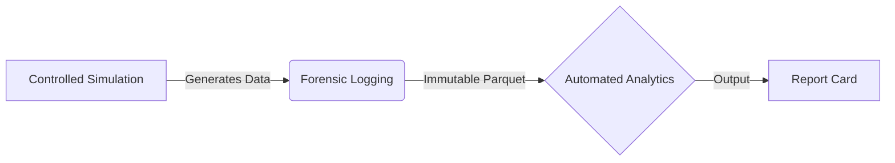
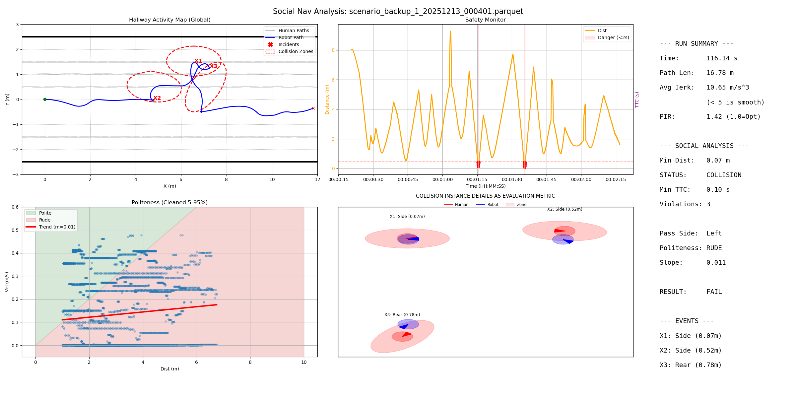

# From Moral Will to Moral Skill: Paltiago Social Navigation Module
> A Forensic Evaluation Harness for the PAL Tiago Robot.


## Gallery
| Gazebo Simulation (Source) | RViz Visualization (Planner) |
| :---: | :---: |
|  |  |
> *Left: The PAL Tiago robot navigating a dynamic crowd in Gazebo. Right: The corresponding visualizations in RViz.*

## Overview
This repository contains the technical artifacts for the MSc Thesis **"From Moral Will to Moral Skill."**

The thesis argues that standard engineering tools possess a "Normative Void"—an ontological bias toward efficiency that ignores social care values. This codebase serves as the **Intermediate Level Knowledge (ILK)** required to bridge that gap. It implements a **Social Momentum** controller to operationalize the ethical value of "Reciprocity" and creates a forensic logging system to validate "Kinematic Legibility".

---
## 1. System Architecture: Bridging the "HRI Gap"

Standard simulations suffer from an **HRI Infrastructure Gap** where human actors are invisible to standard ROS sensors. To allow the robot to demonstrate **Attentiveness**, this system implements a custom relay bridge.


### Integration Points

* **Perception (The Relay Node):** To address the "Ghost Human" problem where standard tools treat people as static obstacles, the `gazebo_actor_relay` node intercepts Gazebo's ground truth (`/model_states`). It broadcasts live positions as standard TF frames (`human_0`, `human_1`), forcing the robot to acknowledge social agents while isolating planner performance from perception noise.
* **Actuation (The Control Loop):** Operating at **20 Hz**, this custom socially-aware controller replaces the standard efficiency-driven Nav2 planner. The MPPI solver packages optimal velocities into `geometry_msgs/Twist` and publishes them to `/mobile_base_controller/cmd_vel_unstamped`, where the standard `ros_control` stack converts the social intent into physical wheel motor currents.

---

## 2. Core Logic: Social Momentum

This repository implements a **Model Predictive Path Integral (MPPI)** controller that optimizes for **Social Momentum**. Unlike standard planners that treat humans as static obstacles or simple repulsion fields, this system actively rewards "legible" passing behavior.

### The Cost Function

The heart of the planner is the cost function, which prevents the "freezing robot" problem by ensuring the robot and human "agree" on a passing side early in the interaction.

* **Mathematical Model:** For every candidate trajectory, the cost is calculated using the **Composite Social Momentum**:

$$Cost \propto -(\mathbf{r}_{ac} \times \mathbf{v}_r + \mathbf{r}_{bc} \times \mathbf{v}_h)$$

Where:

* $\mathbf{r}$ represents the lever arm vectors from the interaction midpoint to the agents.
* $\mathbf{v}$ represents the velocity vectors of the agents.

* **Behavioral Outcome:**

    * **Consistent Sign:** If the robot commits to passing on the left, the cross-product term yields a specific sign. Continuing to pass on the left reduces the cost (reward).
    * **Sign Flipping:** If the robot tries to switch to the right, the sign flips, causing a spike in cost. This effectively creates an "energy barrier" against hesitation or oscillation.


### The Solver

Instead of finding a single global path, the controller uses a sampling-based optimization strategy running on **PyTorch** (CUDA-accelerated if available).

* **Sampling:** 250 random trajectories generated every control cycle (0.05s).
* **Horizon:** 3.0 seconds into the future (assuming a Constant Velocity Model for humans).
* **Constraints:** The solver strictly adheres to TIAGo's kinematic limits ($v_{max} = 0.4$ m/s, $\omega_{max} = 1.5$ rad/s).
---

## 3. Benchmark Results & Analytics

The suite transforms ROS 2 navigation stacks into quantifiable data through a strictly enforced three-stage pipeline:




> *Above: The automated "Forensic Report Card" generated for every run. It aggregates spatial telemetry (Global Trajectory Map), temporal safety data (TTC Monitor), social compliance metrics (Politeness Trend), and a high-level summary of performance indicators (Jerk, PIR, and Pass Side).*

### Standardized Metrics

| Metric Category | Key Indicator | Definition |
| --- | --- | --- |
| **Safety** | **TTC (Time-To-Collision)** | A rolling-median filter (5-sample window) that flags sustained collision risks (<2.0s). |
|  | **Safety Violation** | Any instance where the robot breaches the "Social Ellipse" (1.2m x 0.6m) of a human. |
| **Efficiency** | **PIR (Path Irregularity)** | Ratio of Actual Path vs. Straight Line (1.0 = Perfect). |
| **Comfort** | **Average Jerk** | The mean derivative of acceleration (m/s^3). Values <5.0 indicate passenger-friendly smoothness. |
| **Social** | **Compliance Trend** | A regression of *Robot Velocity* vs. *Human Distance*. "Polite" robots slow down as they approach humans. |

---

## 4. Quick Start

### Launch Simulation & Planner

Spawn the simulation environment with a specific scenario ID (controls crowd density/behavior).

```bash
# Launch the suite (Sim + MPPI Controller)
ros2 launch sm_mppi_planner gazebo_relay_node_all_simulations.launch.py scenario_id:=4

```

### Start Data Acquisition

Launch the logger to begin recording the "Forensic Run."

```bash
ros2 launch sm_mppi_planner log_start.launch.py scenario_id:=4 use_sim_time:=true
```

### Generate Report Cards

Run the dashboard script to process the raw logs and generate visualizations.

```bash
# Processes all raw parquet files and outputs PNG/CSV reports
python3 rosbags/post_processing/analysis_dashboard_robust.py rosbags/raw --folder social_momentum

```

---

## 5. Repository Structure

```text
social_momentum_MPPI/
├── scripts/                  # Batch automation for deterministic reproducibility
├── src/
│   ├── sm_mppi_planner/      # The MPPI controller & Logger Logic
│   │   ├── config.py         # Hyperparameters (Horizon, Samples, Weights)
│   │   ├── sm_mppi.py        # CORE LOGIC: Cost functions & MPPI Class
│   │   ├── ros2_wrapper.py   # ROS NODE: Handles subscribers/publishers
│   │   ├── tf2_wrapper.py    # UTILS: TF buffer management
│   │   ├── utils.py          # Math helpers (normalization, geometry)
│   │   └── vis_utils.py      # Visualization markers for RViz
│   └── tiago_social_scenarios/ # Scenario definitions (Crowd setups)
├── rosbags/
│   ├── raw/                  # IMMUTABLE INPUT: Raw Parquet logs
│   │   ├── NAV2/
│   │   └── social_momentum/
│   └── post_processing/      # DISPOSABLE OUTPUT: Dashboards & CSVs
│       ├── social_momentum/
│       │   ├── run_12_dashboard.png  # Visual Report Card
│       │   └── run_12_metrics.csv    # Machine-readable metrics
└── README.md

```

---

## 6. Acknowledgements & License

**Original Algorithm**
The core **Social Momentum MPPI** implementation and the `pytorch_mppi` logic are the work of the **Fluent Robotics Lab**.
* **Copyright:** (c) 2025, Fluent Robotics Lab

**Thesis Context & Paltiago Extensions**
This code is part of a Master Thesis submitted to **TU Delft**. It represents the practical application of the **Operationalized CCVSD Framework**. The **ROS 2 Integration**, **Forensic Logger**, **Analytics Dashboard**, and **TIAGo specific adapters** were developed to facilitate benchmarking on the PAL Robotics platform.

**Simulation Assets**
The simulation assets (`tiago_simulation`) are property of **PAL Robotics**.

**License**
BSD 3-Clause (See `LICENSE` file).