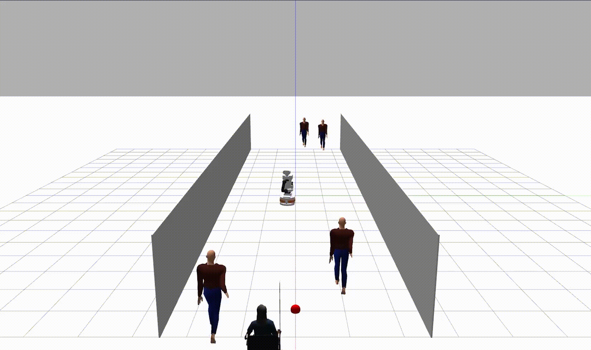
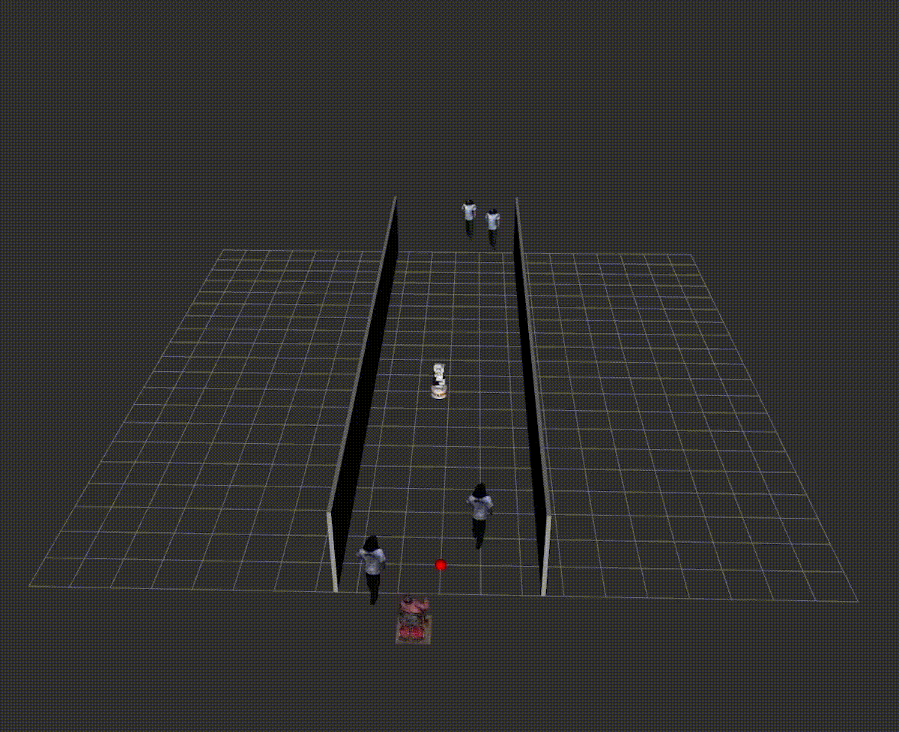

# Paltiago Social Navigation Benchmark Suite

### A Forensic Evaluation Harness for the PAL TIAGo Robot

This repository contains a scientific instrument designed to profile robot navigation algorithms in dynamic, socially complex environments. Unlike standard evaluation scripts, this suite enforces a **forensic workflow**: it decouples simulation, data acquisition, and analytics to ensure that every metric is traceable back to immutable, synchronized ground-truth snapshots.

It is currently configured to benchmark the **Social Momentum MPPI** controller (adapted from Fluent Robotics Lab) against standard baselines like **Nav2** using the **PAL Robotics TIAGo** platform.

<p align="center">
  
  
</p>
<p align="center">
  <em>Figure 1: (Left) The PAL TIAGo robot navigating a dynamic crowd in Gazebo. (Right) The corresponding MPPI trajectory rollouts in RViz.</em>
</p>

---
## 1. System Architecture

This system bridges the high-level algorithmic logic with the physical control layer of the PAL TIAGo robot through a custom simulation bridge. It relies on the [PAL Robotics TIAGo Simulation](https://github.com/pal-robotics/tiago_simulation) stack for underlying physics and robot description.

### The Control Loop
The system operates in a closed-loop cycle at **20 Hz**, replacing the standard `Nav2` local planner while preserving the TIAGo's low-level hardware drivers.

```mermaid
graph TD
    A[Gazebo Simulation] -->|/model_states| B(GazeboActorRelay)
    B -->|/tf human_i frames| C[ROS 2 Wrapper]
    C -->|Current State| D{MPPI Optimizer}
    D -->|Social Momentum Score| D
    D -->|Optimal Velocity| E[/mobile_base_controller/cmd_vel_unstamped]
    E -->|Drive Wheels| A
    E -.->|Synchronized Logging| F[Forensic Logger]

```

### Integration Points

* **Perception (The "Relay"):** The `gazebo_actor_relay` node intercepts Gazebo's ground truth (`/model_states`) and broadcasts live positions as standard TF frames (`human_0`, `human_1`). This isolates the planner performance from perception noise during algorithmic validation.
* **Actuation (The TIAGo):** The optimal velocity from the MPPI solver is packaged into `geometry_msgs/Twist` and published to `/mobile_base_controller/cmd_vel_unstamped`, where the standard `ros_control` stack converts it to wheel motor currents.

---

## 2. Core Logic: Social Momentum

This repository implements a **Model Predictive Path Integral (MPPI)** controller that optimizes for **Social Momentum**. Unlike standard planners that treat humans as static obstacles or simple repulsion fields, this system actively rewards "legible" passing behavior.

### The Cost Function

The heart of the planner is the cost function, which prevents the "freezing robot" problem by ensuring the robot and human "agree" on a passing side early in the interaction.

* **Mathematical Model:** For every candidate trajectory, the cost is calculated using the **Composite Social Momentum**:

$$Cost \propto -(\mathbf{r}_{ac} \times \mathbf{v}_r + \mathbf{r}_{bc} \times \mathbf{v}_h)$$

Where:

* $\mathbf{r}$ represents the lever arm vectors from the interaction midpoint to the agents.
* $\mathbf{v}$ represents the velocity vectors of the agents.

* **Behavioral Outcome:**
    * **Consistent Sign:** If the robot commits to passing on the left, the cross-product term yields a specific sign. Continuing to pass on the left reduces the cost (reward).
    * **Sign Flipping:** If the robot tries to switch to the right, the sign flips, causing a spike in cost. This effectively creates an "energy barrier" against hesitation or oscillation.


### The Solver

Instead of finding a single global path, the controller uses a sampling-based optimization strategy running on **PyTorch** (CUDA-accelerated if available).

* **Sampling:** 250 random trajectories generated every control cycle (0.05s).
* **Horizon:** 3.0 seconds into the future (assuming a Constant Velocity Model for humans).
* **Constraints:** The solver strictly adheres to TIAGo's kinematic limits (v_{max} = 0.4 m/s, w_{max} = 1.5 rad/s).

---

## 3. Benchmark Results & Analytics

The suite transforms ROS 2 navigation stacks into quantifiable data through a three-stage pipeline: **Controlled Simulation** \rightarrow **Forensic Logging** \rightarrow **Automated Analytics**.

### The Analytics Dashboard

The post-processing engine generates a "Report Card" for every run, grading the robot on non-binary criteria such as Politeness and Comfort.

*(Above: Sample output from the Analytics Dashboard. Note the "Politeness" graph (bottom left) which tracks whether the robot slows down as it approaches humans.)*

### Standardized Metrics

| Metric Category | Key Indicator | Definition |
| --- | --- | --- |
| **Safety** | **TTC (Time-To-Collision)** | A rolling-median filter (5-sample window) that flags sustained collision risks (<2.0s). |
|  | **Safety Violation** | Any instance where the robot breaches the "Social Ellipse" (1.2m x 0.6m) of a human. |
| **Efficiency** | **PIR (Path Irregularity)** | Ratio of Actual Path vs. Straight Line (1.0 = Perfect). |
| **Comfort** | **Average Jerk** | The mean derivative of acceleration (m/s^3). Values <5.0 indicate passenger-friendly smoothness. |
| **Social** | **Compliance Trend** | A regression of *Robot Velocity* vs. *Human Distance*. "Polite" robots slow down as they approach humans. |

---

## 4. Quick Start

### Launch Simulation & Planner

Spawn the simulation environment with a specific scenario ID (controls crowd density/behavior).

```bash
# Launch the suite (Sim + MPPI Controller)
ros2 launch sm_mppi_planner gazebo_relay_node_all_simulations.launch.py scenario_id:=4

```

### Start Data Acquisition

Launch the logger to begin recording the "Forensic Run."

```bash
ros2 launch sm_mppi_planner log_start.launch.py scenario_id:=4 use_sim_time:=true

```

### Generate Report Cards

Run the dashboard script to process the raw logs and generate visualizations.

```bash
# Processes all raw parquet files and outputs PNG/CSV reports
python3 rosbags/post_processing/analysis_dashboard_robust.py rosbags/raw --folder social_momentum

```

---

## 5. Repository Structure

```text
social_momentum_MPPI/
├── scripts/                  # Batch automation for deterministic reproducibility
├── src/
│   ├── sm_mppi_planner/      # The MPPI controller & Logger Logic
│   │   ├── config.py         # Hyperparameters (Horizon, Samples, Weights)
│   │   ├── sm_mppi.py        # CORE LOGIC: Cost functions & MPPI Class
│   │   ├── ros2_wrapper.py   # ROS NODE: Handles subscribers/publishers
│   │   ├── tf2_wrapper.py    # UTILS: TF buffer management
│   │   ├── utils.py          # Math helpers (normalization, geometry)
│   │   └── vis_utils.py      # Visualization markers for RViz
│   └── tiago_social_scenarios/ # Scenario definitions (Crowd setups)
├── rosbags/
│   ├── raw/                  # IMMUTABLE INPUT: Raw Parquet logs
│   │   ├── NAV2/
│   │   └── social_momentum/
│   └── post_processing/      # DISPOSABLE OUTPUT: Dashboards & CSVs
│       ├── social_momentum/
│       │   ├── run_12_dashboard.png  # Visual Report Card
│       │   └── run_12_metrics.csv    # Machine-readable metrics
└── README.md

```

---

## 6. Acknowledgements & License

**Original Algorithm**
The core **Social Momentum MPPI** implementation and the `pytorch_mppi` logic are the work of the **Fluent Robotics Lab**.

* **Copyright:** (c) 2025, Fluent Robotics Lab
* **License:** BSD 3-Clause (See `LICENSE` file)

**Paltiago Extensions**
The **ROS 2 Integration**, **Forensic Logger**, **Analytics Dashboard**, and **TIAGo specific adapters** were developed to facilitate benchmarking on the PAL Robotics platform.

**Simulation Assets**
The simulation assets (`tiago_simulation`) are property of **PAL Robotics**.

```

```